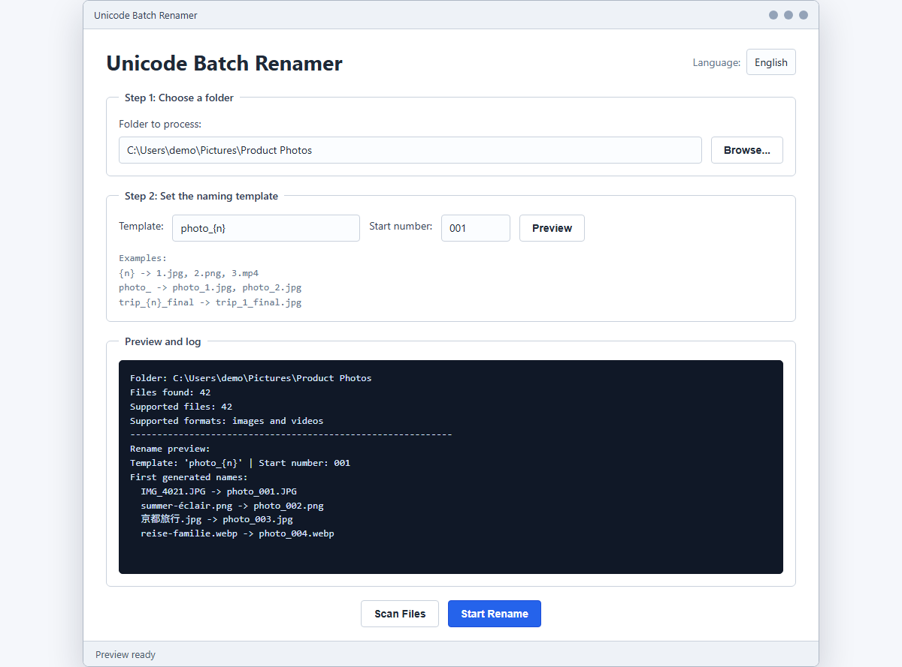

# Unicode Batch Renamer

Recommended GitHub repository name: `unicode-batch-renamer`

Recommended GitHub description:

> No-dependency Python GUI/CLI for safely batch-renaming image and video files with Unicode templates and a multilingual interface.

A small Python tool for safely batch-renaming image and video files. It uses a
two-step rename process so existing names such as `1.jpg` or `2.png` do not
collide with the final output names.



## Features

- Graphical interface built with Python's standard `tkinter`
- English is the default interface language
- Built-in UI translations: English, Chinese, French, German, Japanese
- Unicode file names and templates, so names can contain most world languages
- Custom naming templates such as `{n}`, `photo_`, or `trip_{n}_final`
- Preserves original file extensions
- Preserves leading zeroes in the start number, for example `001`
- No third-party dependencies

## Supported Formats

Images:

`jpg`, `jpeg`, `png`, `gif`, `bmp`, `tiff`, `webp`, `svg`, `ico`

Videos:

`mp4`, `avi`, `mov`, `mkv`, `wmv`, `flv`, `m4v`, `mpg`, `mpeg`, `3gp`, `webm`

## Quick Start

Run the graphical interface:

```bash
python batch_rename_gui.py
```

On Windows, you can also double-click:

```text
start_gui.bat
一键重命名.bat
```

The older Python files with Chinese names are kept as compatibility launchers,
but the maintained entry point is `batch_rename_gui.py`.

## Naming Templates

Use `{n}` where the number should appear:

```text
{n}              -> 1.jpg, 2.png, 3.mp4
photo_           -> photo_1.jpg, photo_2.png
trip_{n}_final   -> trip_1_final.jpg, trip_2_final.png
```

If the template does not include `{n}`, the number is appended automatically.

Set the start number to `001` if you want padded output:

```text
photo_001.jpg, photo_002.jpg, photo_003.jpg
```

## Command Line

Preview and confirm before renaming:

```bash
python rename_images_simple.py "C:\path\to\folder" --template "photo_" --start 001
```

Rename without confirmation:

```bash
python rename_images_simple.py "C:\path\to\folder" --template "{n}" --yes
```

Use another console language:

```bash
python rename_images_simple.py --language fr
```

## Internationalization

Translations live in `i18n.py`. To add a new UI language:

1. Add a language code and display name to `LANGUAGES`.
2. Add that language's strings to `TRANSLATIONS`.
3. Missing strings automatically fall back to English.

The rename engine itself is Unicode-safe because it uses Python 3 `pathlib`
paths and does not restrict letters from other writing systems. It only blocks
characters that are unsafe in cross-platform file names, such as `/`, `\`, `?`,
`*`, and `:`.

## Safety Notes

Always back up important files before bulk renaming. The tool performs a
temporary rename phase first and tries to roll back if an error occurs, but no
bulk file operation can guarantee recovery from every filesystem or permission
failure.

## GitHub Release Checklist

- Add screenshots of the GUI in English and at least one translated language
- Create a short release zip that includes the Python files and Windows batch
  launchers
- If you package an `.exe`, keep the Python source visible in the repository
